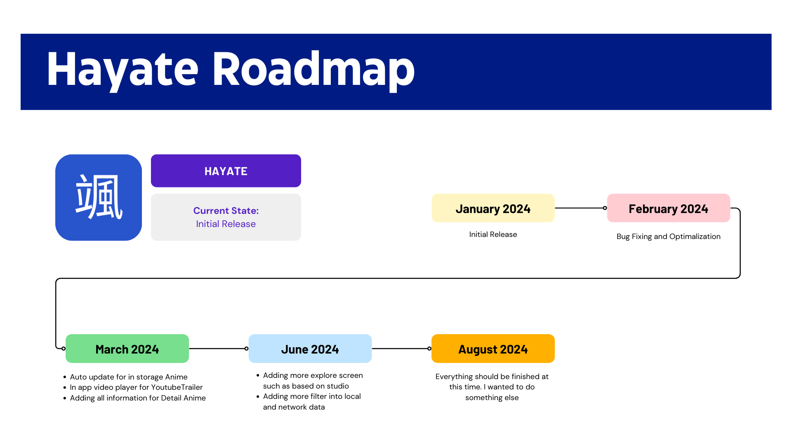

  

# Hayate

Hayate is your go-to mobile application for Android, meticulously crafted in Kotlin. This app is
designed to be your swift companion in the world of anime, providing quick and seamless guidance.
Powered by the [Jikan API](https://jikan.moe/), a dynamic and community-driven resource for
anime-related data, Hayate offers an immersive experience for anime enthusiasts.

# Roadmap
Here is the current plan for Hayate Development:

   

## Features
Hayate currently consist of the following features:

### Explore Screen
The Explore page serves as your gateway to the vibrant world of anime, offering a comprehensive view
of what's happening in the anime community today:

1. **Today's Airing Anime**: Stay in the loop with the latest episodes airing today.
2. **Popular Anime**: Discover the hottest and most beloved anime series.
3. **This Season Airing**: Explore the exciting anime currently airing in the current season.
4. **Upcoming Season**: Get a sneak peek into what's on the horizon for the next season.
5. **Search Functionality**: Effortlessly find your favorite anime with the intuitive search
   feature.

### Collection Screen
The Collection screen provides a personalized space for managing your anime activities:

1. **Recently Viewed**: Quickly revisit the anime you've recently explored.
2. **Watchlist**: Keep track of the anime you're planning to watch in the future.

### Detail Screen
1. **Detailed Anime Information**: Explore comprehensive details about the selected anime.
2. **Add to Watchlist**: Personalize your anime journey by adding selected series to your watchlist.

## Tech Stack

Here's an overview of the technologies and libraries that power Hayate:

1. **Jetpack Compose**: Hayate uses Jetpack Compose for efficient and immersive UI development,
   aligning seamlessly with its user-friendly interface goals.
2. **Firebase**: Hayate uses Firebase for scalable backend services. Firebase Analytics provides
   insights, Remote Config adjusts configurations dynamically, and Crashlytics offers real-time
   crash reporting for enhanced stability.
3. **Dagger Hilt**: Hayate utilizes Dagger Hilt for clean and modular Android dependency injection.
   Hilt simplifies integration, enhancing code readability and scalability while facilitating future
   expansion.
4. **Retrofit**: Hayate relies on Retrofit for streamlined and type-safe HTTP requests, simplifying
   API communication and ensuring reliable data exchange for efficient anime-related information
   retrieval.
5. **Room**: Hayate relies on Room for seamless SQLite database integration in Android. Room
   simplifies data persistence, providing an efficient and structured approach for managing
   anime-related information locally.
6. **ViewModel**: Hayate utilizes ViewModel for efficient data management and a streamlined,
   user-friendly anime guide experience.
7. **Coroutine**: Hayate utilizes Kotlin Coroutines for streamlined asynchronous programming,
   enhancing code readability and performance in delivering an efficient anime guide experience.
8. **Moshi**: Hayate employs Moshi for efficient JSON parsing in Kotlin, simplifying data
   serialization and deserialization for managing anime-related information.
9. **DataStore Preferences**: Hayate improves data storage efficiency with DataStore Preferences on
   Android. It checks feature availability in real-time through remote configuration, simplifying
   the management of app settings for a smoother user experience.

## License 
Hayate is open-source and released under the [MIT License](LICENSE).
